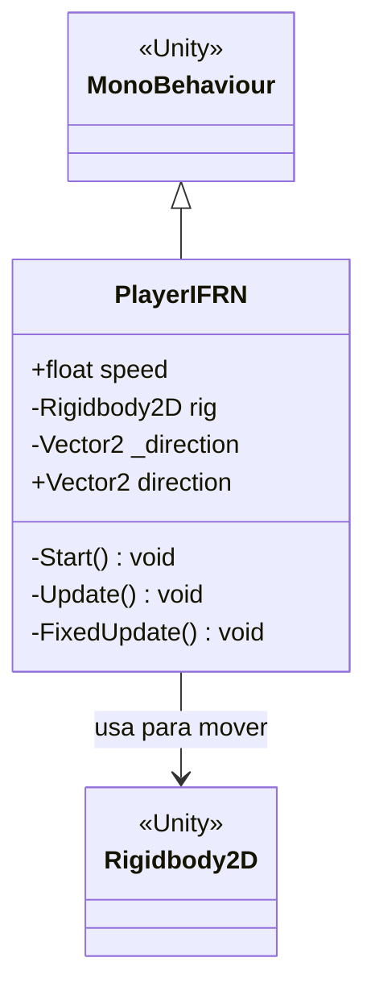

```mermaid
classDiagram
    class MonoBehaviour {
        <<Unity>>
    }

    class PlayerIFRN {
        +float speed
        -Rigidbody2D rig
        -Vector2 _direction
        +Vector2 direction
        -Start() void
        -Update() void
        -FixedUpdate() void
    }

    class Rigidbody2D {
        <<Unity>>
    }

    MonoBehaviour <|-- PlayerIFRN
    PlayerIFRN --> Rigidbody2D : usa para mover
```