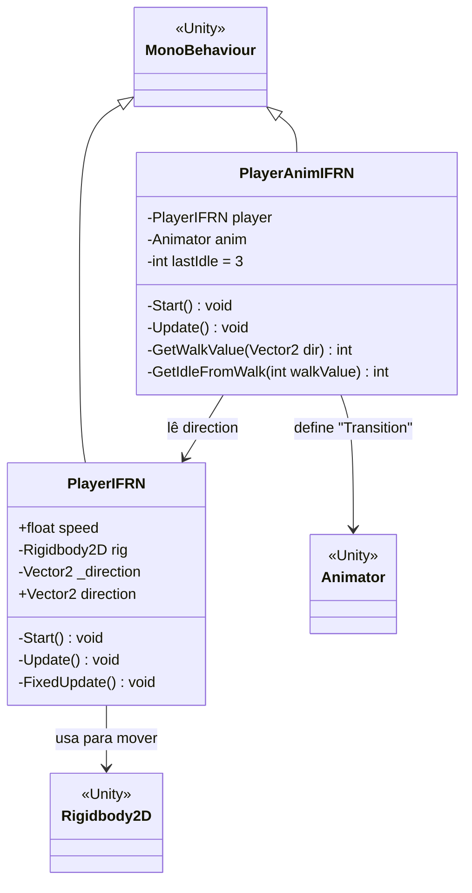

```mermaid
classDiagram
    class MonoBehaviour {
        <<Unity>>
    }

    class Animator {
        <<Unity>>
    }

    class Rigidbody2D {
        <<Unity>>
    }

    class PlayerIFRN {
        +float speed
        -Rigidbody2D rig
        -Vector2 _direction
        +Vector2 direction
        -Start() void
        -Update() void
        -FixedUpdate() void
    }

    class PlayerAnimIFRN {
        -PlayerIFRN player
        -Animator anim
        -int lastIdle = 3
        -Start() void
        -Update() void
        -GetWalkValue(Vector2 dir) int
        -GetIdleFromWalk(int walkValue) int
    }

    MonoBehaviour <|-- PlayerIFRN
    MonoBehaviour <|-- PlayerAnimIFRN
    PlayerIFRN --> Rigidbody2D : usa para mover
    PlayerAnimIFRN --> PlayerIFRN : lê direction
    PlayerAnimIFRN --> Animator : define "Transition"
```