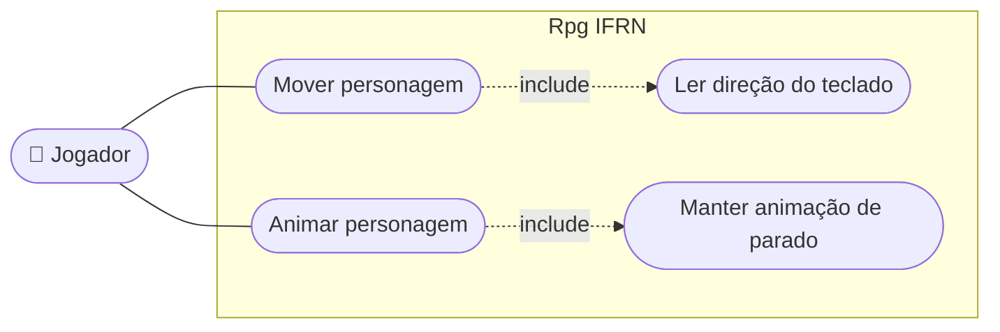

```mermaid
flowchart LR
    Jogador(["👤 Jogador"])

    subgraph Sistema["Rpg IFRN"]
        UC1([Mover personagem])
        UC2([Ler direção do teclado])
        UC3([Animar personagem])
        UC4([Manter animação de parado])
    end

    Jogador --- UC1
    Jogador --- UC3

    UC1 -. include .-> UC2
    UC3 -. include .-> UC4
```